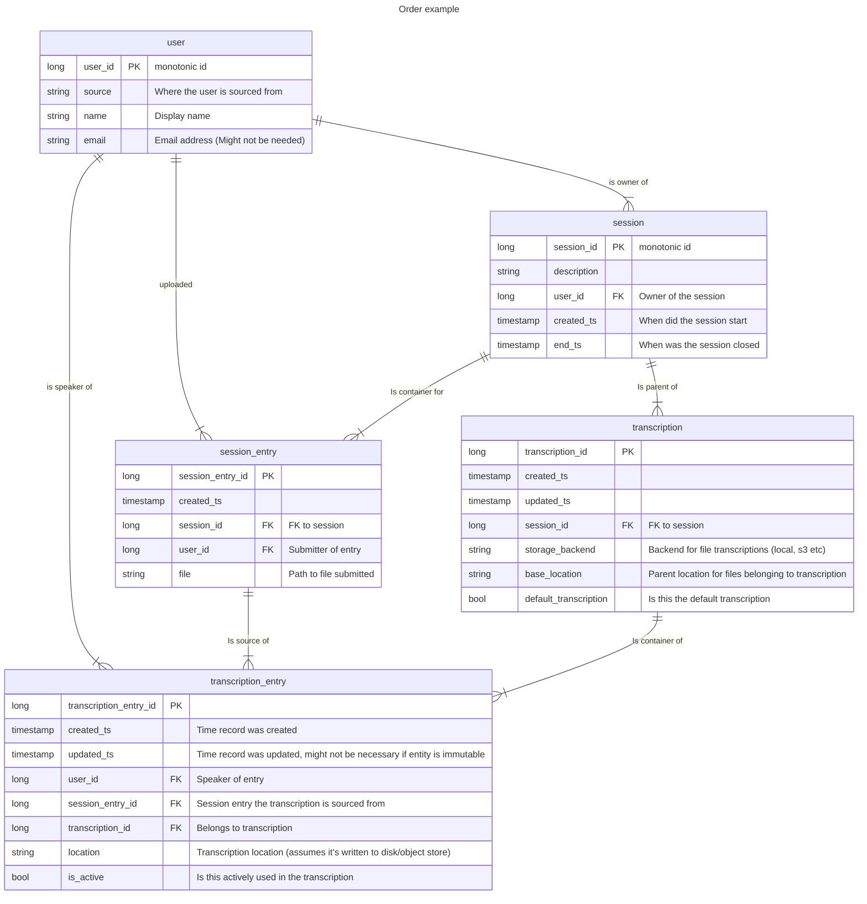
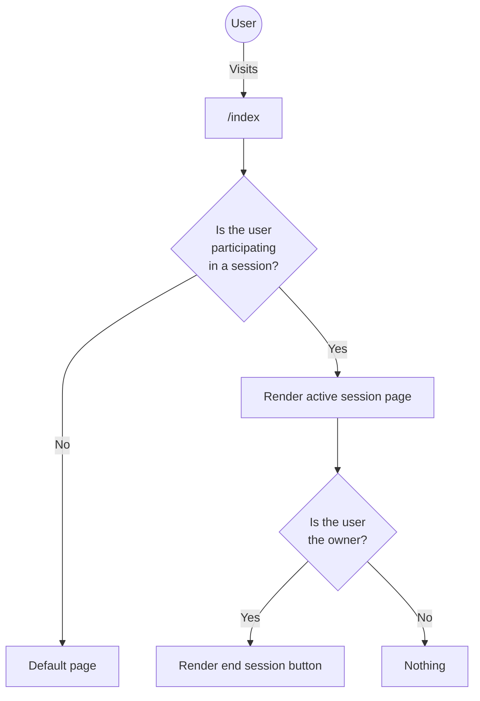
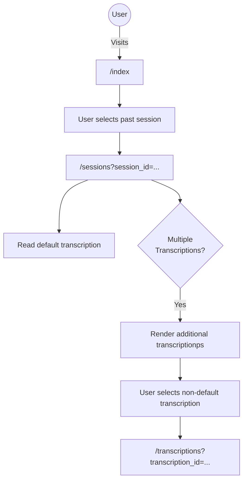
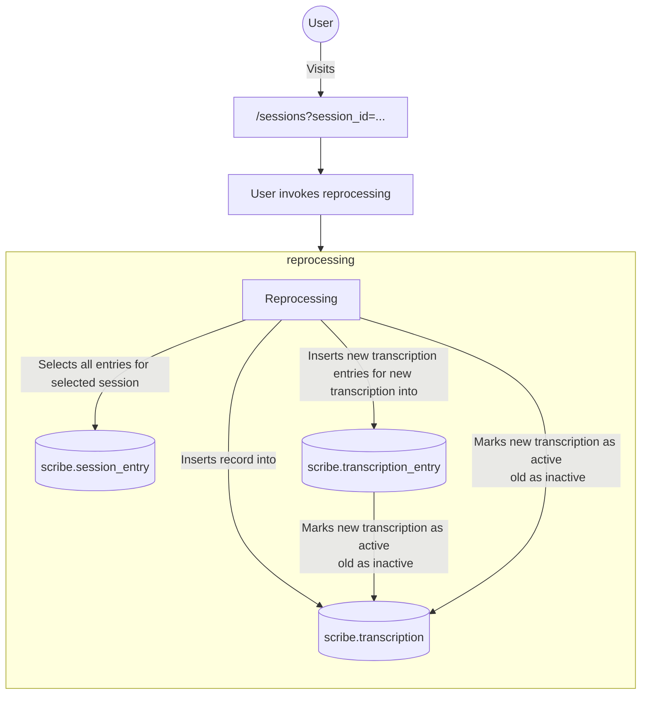

# scribe

# Requirements
## System packages
```
sudo apt install portaudio19-dev ffmpeg
```

# Installation
```
git clone
poetry shell
poetry install
```

Init DB
```
flask --app scribe.server init-db
```

# Backend Design
Features
- Multiple users can contribute to the same transcription
- Transcriptions can be replayed

## Entities
- User
- Session
- Session Entry
- Transcription
- Transcription Entry



### User
Represents a users, pretty straight forward.

| What    | Description                         |
|---------|-------------------------------------|
| user_id | monotonic id                        |
| source  | Where the user is sourced from      |
| name    | Display name                        |
| email   | Email address (might not be needed) |


### Session
A session in which users have submitted audio for transcription. Main entity for managing transcriptions.

| What        | Description          |
|-------------|----------------------|
| session_id  | monotonic id         |
| description |                      |
| user_id     | Owner of the session |
| start_ts    |                      |
| end_ts      |                      |

### Session Entry
Represents a file submitted to a session. User and timestamps are used display when what parts were spoken.

| What             | Description              |
|------------------|--------------------------|
| session_entry_id | monotonic id             |
| created_ts       | Time record was inserted |
| session_id       | FK to session            |
| user_id          | Submitter of entry, FK   |
| file             | Path to file submitted   |


### Transcription
A transcription. Doesn't contain text, but is more a container. This is done so we can track timestamps and speakers on 
individual transcriptions. Due to the non-deterministic nature of ML, as well as the different accuracies between models
depending on size and languages trained on, we should be able to support rerunning transcriptions on the entire dataset,
or individual entries (see below). Therefor there can be multiple transcriptions per session.

| What                  | Description                                          |
|-----------------------|------------------------------------------------------|
| transcription_id      | monotonic id                                         |
| created_ts            | Time record was inserted                             |
| updated_ts            | Time record was updated                              |
| session_id            | FK to session                                        |
| storage_backend       | Backend for transcription files (local, s3 etc)      |
| base_location         | Parent location for files belonging to transcription |
| default_transcription | Is this the default transcription                    |

### Transcription Entry
An actual transcription of a file. One or more entries make up an actual transcription. TODO: Decide on whether the
transcription should be stored on the db, or on disk/object store.

| What                   | Description                                     |
|------------------------|-------------------------------------------------|
| transcription_entry_id | monotonic id                                    |
| created_ts             | Time record was inserted                        |
| updated_ts             | Time record was updated                         |
| user_id                | Speaker of entry, user FK                       |
| session_entry_id       | Session entry the transcription is sourced from |
| transcription_id       | Belongs to transcription, FK                    |
| location               | Transcription location                          |
| is_active              | Is this actively used in a transcription        |


## User actions
The user can 
- Start/end a session
- Read a transcription
- Submit a session for reprocessing
- Submit a transcription_entry for reprocessing

A user can potentially:
- Reorder transcription entries
- Split transcription entries


### Start/end session
All these graphs assume the user is logged in



### Read a transcription


### Submit a session for reprocessing
